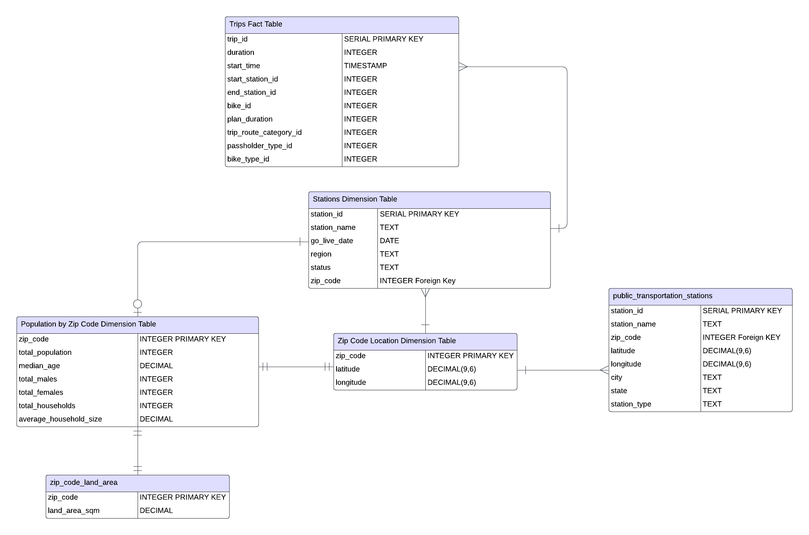
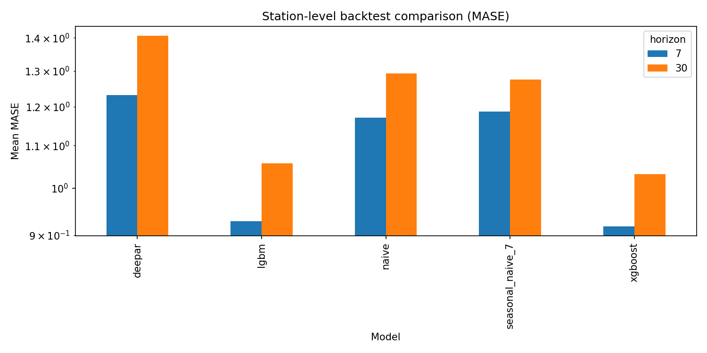

# Metro Bike Share Demand Intelligence


Metro Bike Share does not have one demand problem.

It has a **network problem**: how much total demand is coming?  
And it has a **station problem**: where will that demand actually show up?

This repository was revised to answer both.

It keeps the original SQL work visible, adds a cleaner warehouse and forecasting structure around it, and turns the project into a usable decision system: diagnose the signal, compare models honestly, generate forecasts with uncertainty, and review everything in one dashboard.


> **What this system is really for**  
> Better demand visibility before demand becomes an operations problem.

---

## Why this architecture exists

The architecture is deliberate.

This project is still worth continuing because many data-oriented initiatives across companies are now being revisited and modernized. In this case, the earlier work was built on a strong foundation, especially in the extraction of business logic and the development of an enhanced data model. 



That foundation should be preserved because it still provides real value. At the same time, renewal is necessary: forecasting requires more than legacy SQL logic. It needs a clearer and more modern path from raw data to diagnosis, from diagnosis to modeling, and from modeling to production-ready pipelines that a team can review, trust, and use.

That is why the project is structured as an end-to-end workflow that spans data modeling and standardization through to dashboards and monitoring.:

| Layer | Why it exists | What it gives you |
|---|---|---|
| Legacy SQL | Preserve trusted historical logic | Business rules and cleaned foundations |
| Warehouse Layer | Create a better engineering bridge | Reusable structure, contracts, utilities |
| Diagnosis | Understand the signal before modeling | Stronger assumptions and cleaner framing |
| Forecasting | Compare methods in a time-aware way | Actionable predictions at multiple levels |
| Dashboard | Make results easier to read and share | Faster review and clearer communication |


---

## Two forecasting views, one product story

This project uses two views because planning and operations need different kinds of visibility.

### System view
The system-level side treats the network as one demand series. It is the planning view: cleaner, smoother, and easier to interpret for direction, seasonality, horizon design, and overall forecast quality.

### Station view
The station-level side keeps the local picture. It is the operations view: noisier, more heterogeneous, and much closer to the actual places where demand decisions matter. It is where maturity, sparsity, categories, and clusters become important.


The point is not to choose one over the other. The point is to let them work together:
>- the **system view** gives confidence in overall demand structure
>- the **station view** shows where the average breaks down

---

## How the system makes forecasting more credible

This is not a repo built around one favorite model or one flattering score.

Instead, the project is built around a more credible evaluation pattern:

- compare multiple model families, not just one
- evaluate by horizon, not one pooled average
- evaluate by slice where station behavior differs
- keep uncertainty visible through forecast intervals
- separate diagnosis from forecasting so model choices have context

That is what makes the work stronger as a product, not just cleaner as a repository.

<table>
  <tr>
    <td align="center" width="50%">
      
      <br>
      <sub><b>Station level</b></sub>
    </td>
    <td align="center" width="50%">
      
      <br>
      <sub><b>System level</b></sub>
    </td>
  </tr>
</table>

## The four pipeline paths

The easiest way to understand the system is to read it as four connected pipelines.

| Pipeline | Role | Results |
|---|---|---|
| System-Level Diagnosis | Understand aggregate signal quality, seasonality, and structure | [System-Level Diagnosis](diagnosis/system_level/) |
| Station-Level Diagnosis | Understand heterogeneity, sparsity, maturity, and behavior slices | [Station-Level Diagnosis](diagnosis/station_level/) |
| System-Level Forecasting | Build the network-wide planning baseline | [System-Level Forecasting](forecasts/system_level) |
| Station-Level Forecasting | Build the local station-day operational view | [Station-Level Forecasting](forecasts/station_level) |


[Open the dashboard demo video](dashboard/dashboard-demo.mov)

---

## Quick start

### Setup

Requires Python 3.10 or newer.

```bash
# Clone repo
git clone https://github.com/sastmo/Metro-Bike-Share.git
cd Metro-Bike-Share

# Create and activate virtual environment
# Windows:
py -3 -m venv .venv
.venv\Scripts\activate        # CMD
.venv\Scripts\Activate.ps1    # PowerShell

# macOS / Linux:
python3 -m venv .venv
source .venv/bin/activate

# Install dependencies
python -m pip install --upgrade pip
python -m pip install -r requirements.txt
python -m pip install -e .
```

Set `POSTGRES_URL` only if you want PostgreSQL persistence.

### Common commands

| Task | Command | Outputs |
|---|---|---|
| System-level diagnosis | `python -m system_level.cli diagnose --level system <dataset.csv> --target-col trip_count --time-col bucket_start --segment-type system_total --segment-id all` | `diagnosis/system_level/outputs/` |
| Station-level diagnosis | `python -m system_level.cli diagnose --level station --input <station_daily.csv> --date-col date --station-col station_id --target-col target` | `diagnosis/station_level/outputs/` |
| System-level forecasting | `python -m system_level.cli forecast --level system --config configs/system_level/config.yaml --verbose` | `forecasts/system_level/` |
| Station-level forecasting | `python -m system_level.cli forecast --level station --config configs/station_level/config.yaml --verbose` | `forecasts/station_level/` |
| Dashboard | `python -m streamlit run scripts/dashboard/run_dashboard.py` | `http://localhost:8501` |

Optional runtime check before forecasting:

```bash
python -m system_level.cli doctor --level station --config configs/station_level/config.yaml
```
