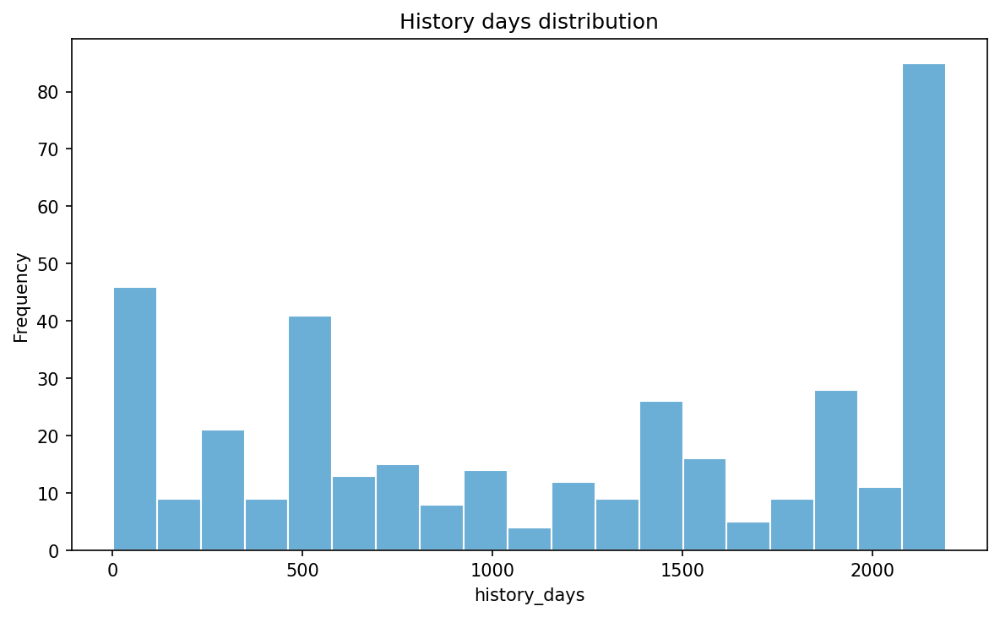
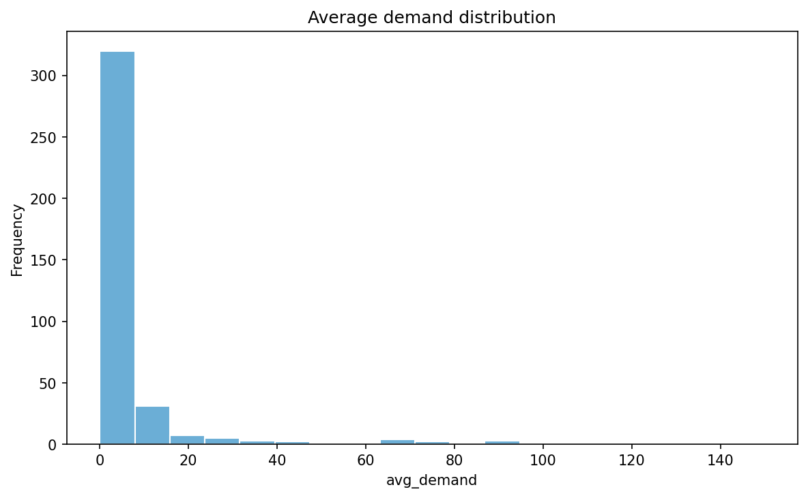
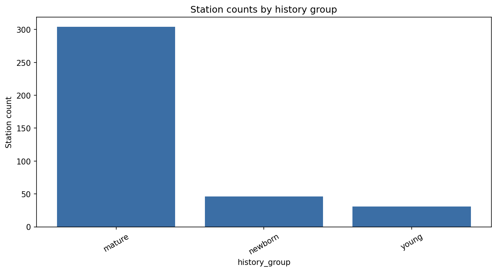
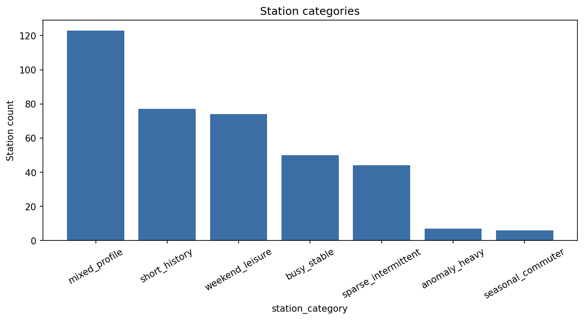
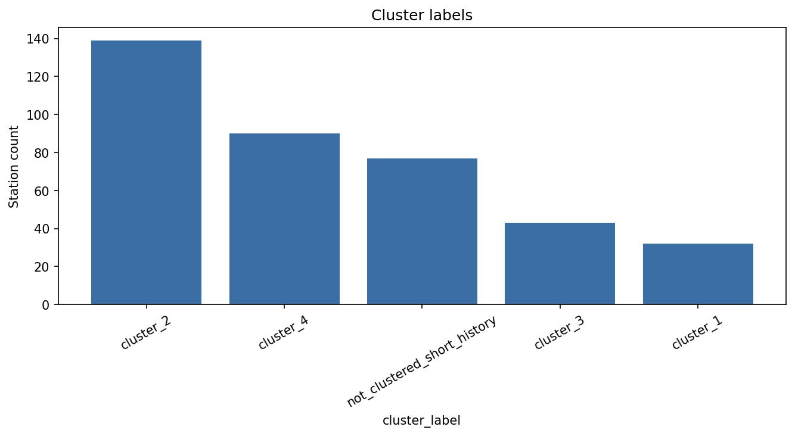
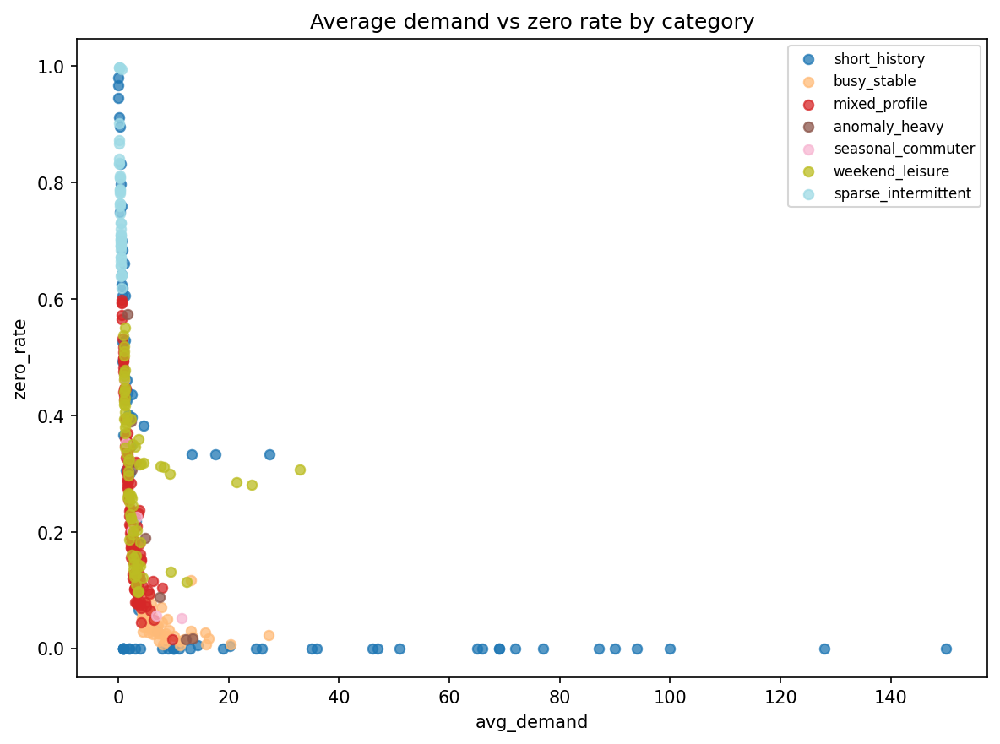
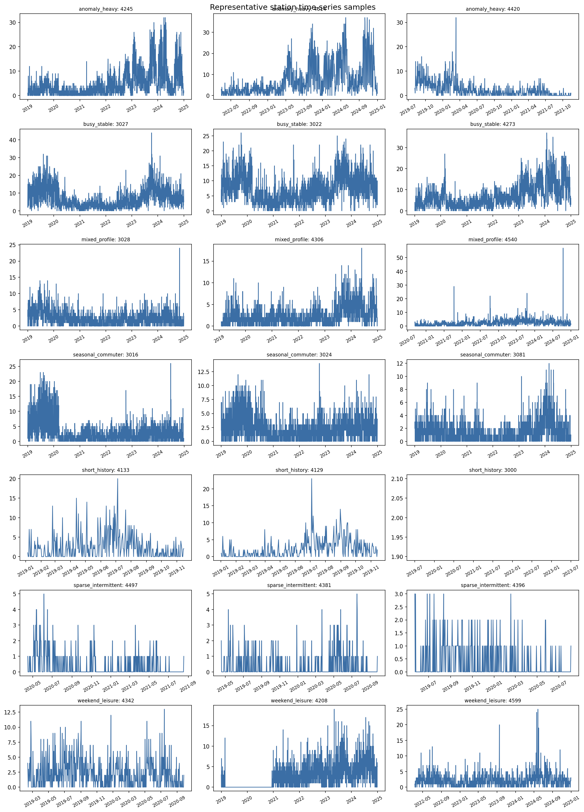

# Station-Level Demand Diagnosis

  
    EDA
    Data Analysis
  
  
    Time Series
    Diagnosis
  
  
    Station Level
    Forecasting
  
  
    Segmentation
    Slices
  
  
    Maturity
    Signal Quality
  
  
    Modeling
    Global Station-Day
  

A summary of what the station network looks like, why station behavior is not uniform, and what that means for the next forecasting step.

## What This Covers
This view treats each station as part of a broader station-day forecasting problem. For logistics decisions such as rebalancing and inventory management, system-level forecasts are not enough; station-level visibility is needed to support action where demand actually occurs.

To make that variation readable, we use both categorization and clustering: categorization groups stations by broad operational traits such as maturity, activity, and behavior, while clustering gives a finer view of similarity within the mature station base.

## Network Snapshot

| Measure | Value |
|---|---:|
| Expected stations | 340 |
| Observed stations | 381 |
| Gap vs expected | +41 |
| Mature stations | 304 |
| Newborn + young stations | 77 |
| Not recently active | 158 |
| Nearly always zero | 6 |

## Key Signal Views

### 1. Frequency of Stations by Available History Length

_Observed station universe: Station history is highly uneven, with a large mature core and a meaningful short-history tail that should be evaluated separately in forecasting._

### 2. Demand Across Stations

_How average demand is distributed across stations._

### 3. Maturity Profile

_Newborn, young, and mature station counts._

### 4. Behavioral Categories

_Station counts across the behavioral categories._

### 5. Mature-Station Clusters

_Counts for mature-station clusters and short-history bucket._

### 6. Signal Quality View

_Reveals which station categories are strong-signal versus sparse or intermittent by comparing average demand with zero-day frequency, helping define forecasting slices and watchlists.._

### 7. Watchlist Example

_Why short-history and sparse stations need special handling._

## Main Readout
- The station network is heterogeneous, not uniform.
- The observed station universe is broader than the expected operational count.
- Demand is highly skewed, so one “typical station” is a weak summary.
- Short-history, sparse, and inactive stations should not be mixed with the healthy core when judging model quality.
- The best first forecasting path is one global station-day workflow with explicit slices.

## Why the Average Station Is Misleading

| Metric | Value |
|---|---:|
| Mean station average demand | 7.04 |
| Median station average demand | 2.46 |
| 75th percentile | 4.89 |
| 90th percentile | 12.48 |
| 95th percentile | 27.20 |

The gap between the mean and median shows a strongly skewed network with a small high-demand group and a long low-demand tail.

## How to Read the Network

| Lens | What it tells us |
|---|---|
| Maturity | How much history a station has |
| Activity | Whether the station is currently active enough to matter |
| Category | What kind of behavior the station shows |
| Cluster | Which mature stations are numerically similar |

## Behavioral Categories

| Category | Count | Readout |
|---|---:|---|
| mixed_profile | 123 | Broad middle of usable stations |
| short_history | 77 | Too new or too incomplete for stable interpretation |
| weekend_leisure | 74 | Stronger weekend-oriented behavior |
| busy_stable | 50 | Productive and reliable core |
| sparse_intermittent | 44 | Weak-signal tail with many zero days |
| anomaly_heavy | 7 | Small group with unusual spikes or shifts |
| seasonal_commuter | 6 | Small weekday-oriented segment |

## Mature-Station Clusters

| Cluster | Count | Readout |
|---|---:|---|
| cluster_1 | 32 | Strong core with high demand and stronger recurring structure |
| cluster_2 | 139 | Main operating base of the mature network |
| cluster_3 | 43 | More weekend-sensitive and more volatile |
| cluster_4 | 90 | Weak-signal mature tail |
| short-history bucket | 77 | Kept outside mature clustering |

## Watchouts

| Topic | Readout |
|---|---|
| Raw busiest stations | Can be distorted by one-day short-history records |
| Sparse stations | Need separate treatment from healthy active stations |
| Anomaly-heavy stations | Should be monitored without driving the default model choice |
| Inactive stations | Matter for reporting, but should not define the core benchmark |

## What This Means for Forecasting

| Decision | Recommendation | Reason |
|---|---|---|
| Forecasting unit | Use station-day | Keeps local detail while learning from the full network |
| First model strategy | Start global | Avoids fragmenting the data too early |
| Evaluation | Use slices | Compare core, short-history, sparse, and cluster groups separately |
| Short-history stations | Treat as maturity issue | Not a true behavior segment |
| Sparse stations | Keep visible, score separately | Important for governance, weak for first-stage selection |
| Clusters | Use later for refinement | Helpful lens, not the first split |

## Recommended Direction
The strongest next step is a single global station-day forecasting workflow. Train globally, evaluate by slice, and refine only where the residuals show a real need.

## Next Step
Use this diagnosis to benchmark station-day models, report performance by slice, and decide where targeted refinement adds real value.
