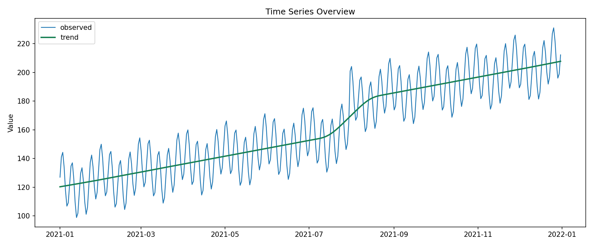
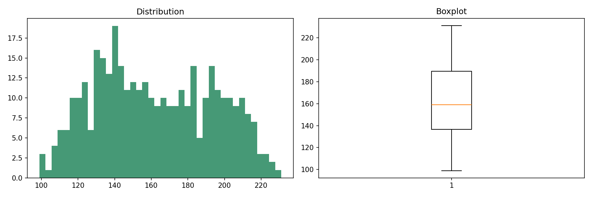
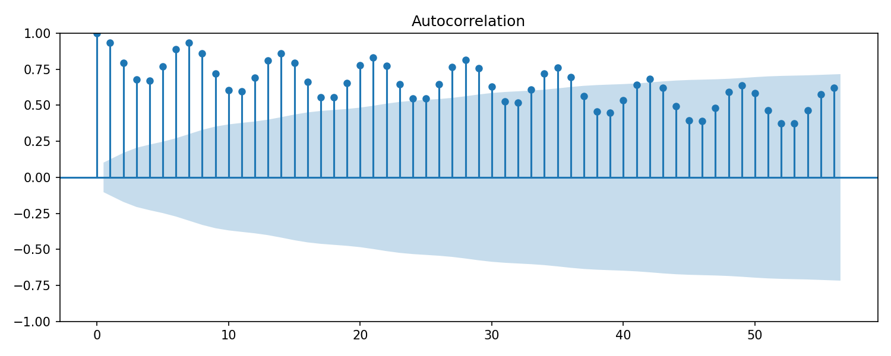
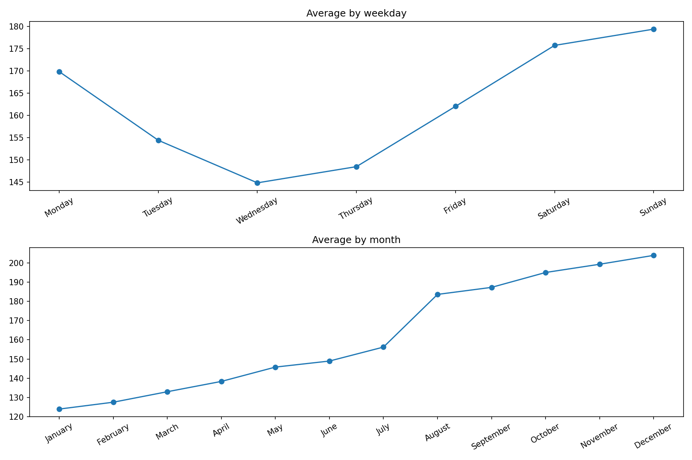
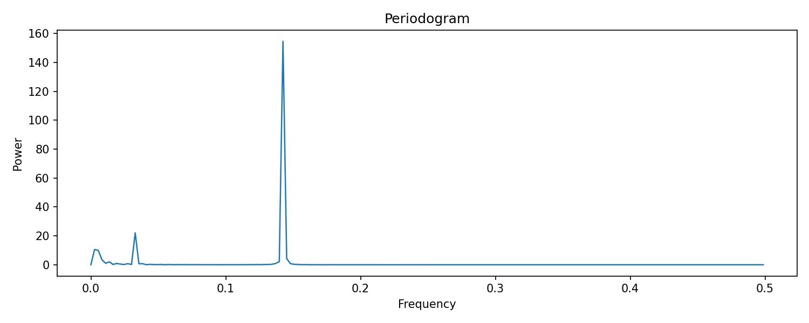
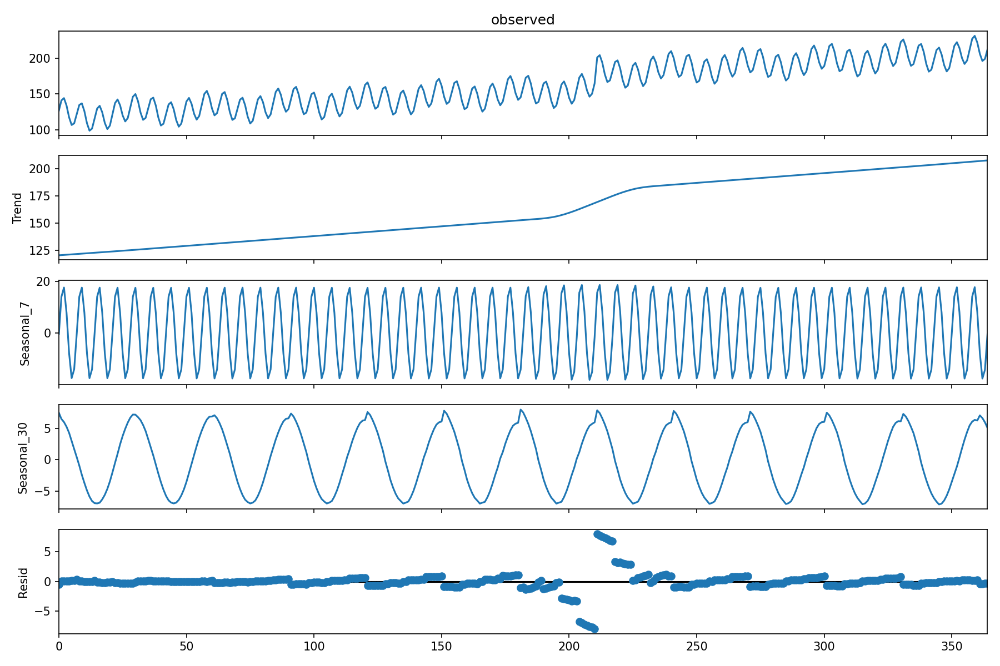

# System-Level Demand Diagnosis

  
    EDA
    Data Analysis
  
  
    Time Series
    Diagnosis
  
  
    System Level
    Forecasting
  
  
    Frequency Domain
    Seasonality
  
  
    Multi-Horizon
    7d / 30d / 90d
  
  
    Uncertainty
    Intervals
  

A short diagnostic summary of aggregate bike-sharing demand and what it means for forecasting.

## What This Covers
This view treats the full network as one time series. At the system level, the signal is smoother than station-level demand and easier to read for trend, seasonality, and forecasting direction.

## Key Signal Views

### 1. Aggregate Demand Over Time

_Overall system demand across the full observation window._

### 2. Demand Distribution

_Distribution of aggregate demand values._

### 3. Autocorrelation

_Correlation of the series with its past lags._

### 4. Seasonal Pattern

_Repeating demand pattern across the weekly cycle._

### 5. Frequency-Domain View

_Weekly, monthly, and yearly seasonal structure in the signal._

### 6. Decomposition

_Trend, seasonal, and residual components of the series._

## Main Readout
- The aggregate demand signal is forecastable and not random.
- The series shows persistence and clear seasonality.
- Frequency analysis suggests recurring weekly, monthly, and yearly structure.
- Forecast quality changes by horizon, so model claims should be horizon-specific.
- Multi-horizon forecasting is needed because operational, planning, and directional decisions happen on different time windows.

## Forecasting Direction

| Model / Layer | Best Use | Strength | Watchout |
|---|---|---|---|
| Seasonal Naive | Baseline for short repeating cycles | Simple and transparent | Limited flexibility |
| ETS / Classical Models | Strong short-horizon benchmark | Stable and interpretable | Can miss changing patterns |
| Fourier / Regression / SARIMAX | Medium-horizon candidate | Captures smoother seasonal structure | Needs monitoring |
| Probabilistic Layer | All horizons | Adds forecast intervals | Depends on point forecast quality |

## Why Multi-Horizon Forecasting
A 7-day forecast supports near-term operations. A 30-day forecast supports planning. A 90-day forecast is more useful as a directional view and should be interpreted more cautiously.

## Why Not Only Point Forecasts
Point forecasts are useful, but they do not show the likely range around the prediction. The next step should keep prediction intervals alongside the main forecast.

## Next Step
Use this diagnosis as the foundation for model benchmarking, horizon-specific evaluation, and interval design.
