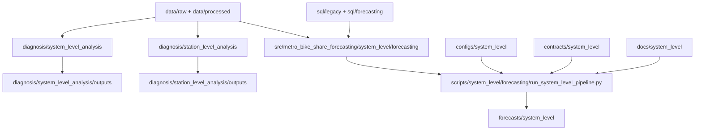

# Architecture

## Purpose

This branch now follows a cleaner split between:

- diagnosis work
- reusable forecasting code
- operational run scripts
- generated artifacts

The goal is to make system-level and station-level work easy to understand without mixing analysis, forecasting, and outputs in the same place.

## Current Architecture

## Layer Responsibilities

### `diagnosis/`

Diagnosis-only workflows.

- `diagnosis/system_level_analysis/`
  System-level time-series diagnosis and reusable diagnostics runner.
- `diagnosis/station_level_analysis/`
  Station summary, rule-based categorization, clustering, and markdown reporting.

These folders own their own local outputs so diagnosis artifacts do not get mixed with forecasting artifacts.

### `src/`

Reusable Python code.

- `src/forecasting_diagnostics/`
  generic forecasting diagnostics package used by the system-level diagnosis runner
- `src/metro_bike_share_forecasting/system_level/forecasting/`
  system-level forecasting package, including features, models, backtesting, intervals, and reporting

- `src/metro_bike_share_forecasting/system_level/diagnosis/`
  thin system-level diagnosis wrapper around the reusable diagnostics layer

### `scripts/`

Runnable operational entrypoints.

- `scripts/system_level/forecasting/run_system_level_pipeline.py`
  runs the system-level daily forecasting pipeline

### `forecasts/`

Forecasting outputs only.

- `forecasts/system_level/`
  backtests, forecasts, metrics, reports, model metadata, figures, and feature artifacts for the system-level forecast pipeline

### `data/`

- `data/raw/`
  raw local inputs
- `data/interim/`
  derived local analysis data such as station-level daily inputs
- `data/processed/`
  processed data products generated by the broader pipeline

### `docs/`, `configs/`, `contracts/`

Support the forecasting packages without storing generated artifacts.

- `docs/system_level/`
  system-level scope, diagnostics, model selection, and evaluation notes
- `configs/system_level/`
  system-level runtime configuration
- `contracts/system_level/`
  formal system-level forecasting contract

## Current Maturity

- system-level diagnosis: active
- system-level forecasting: active
- station-level diagnosis: active
- station-level forecasting: intentionally deferred

## Standard Going Forward

- diagnosis code and diagnosis outputs stay under `diagnosis/`
- forecasting code stays under `src/`
- runnable pipeline entrypoints stay under `scripts/`
- forecast artifacts stay under `forecasts/`
- docs stay under `docs/`
- derived local inputs go under `data/interim/`

This is the structure future station-level forecasting should follow as well.
