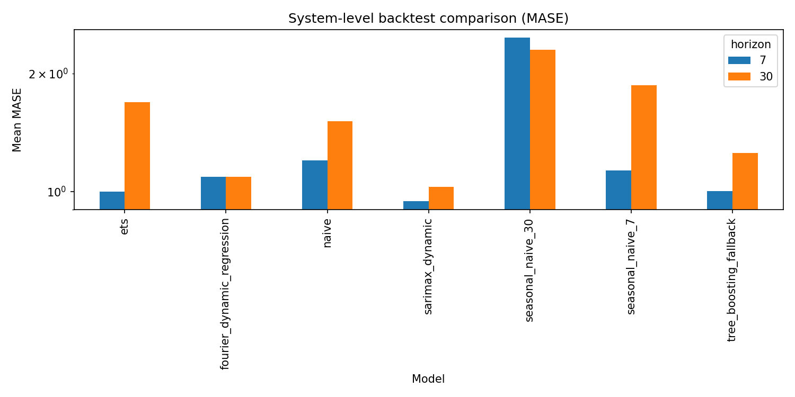

# Aggregate Network Demand Forecasting

# Aggregate Network Demand Forecasting

This module examines forecasting at the **aggregate network level**, where the target is total daily demand across the full system. The goal is to build a reliable system-level view that supports planning, monitoring, and decision-making before moving to more granular forecasting layers.

The workflow compares multiple forecasting methods across **7-day, 30-day, and 90-day horizons**, combining **time series** and **machine learning** approaches within a shared evaluation framework. Performance is assessed with **walk-forward validation**, practical error metrics, and **confidence intervals** to make the results more useful for real planning decisions.

## Workflow

1. Aggregate the network into a single daily demand series.
2. Train and compare multiple forecasting methods on the same system-level target.
3. Evaluate performance with walk-forward validation to preserve time order.
4. Review results by forecast horizon using both point forecasts and confidence intervals.

## What This Shows

- the system-level forecasting setup
- the multi-horizon comparison framework
- the model performance view across horizons
- the practical planning takeaway from the current baseline

## Key Takeaways

- Aggregate demand is forecastable and strong enough to support practical planning.
- The forecasting pipeline is functioning end to end.
- Both time series and machine learning methods can be compared within the same framework.
- Forecast quality should be interpreted by horizon rather than by a single summary score.
- Confidence intervals add useful context for planning, inventory, and redistribution decisions.
- The 7-day horizon is mainly operational, the 30-day horizon is tactical, and the 90-day horizon is best treated as directional sensitivity.

## Outcome

The main outcome is a working **system-level forecasting baseline** with horizon-aware model comparison. This creates a practical foundation for aggregate demand planning, network monitoring, and better-informed operational decisions.
